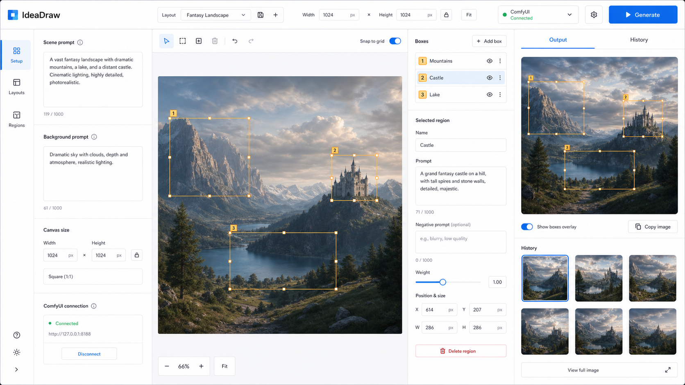

# IdeaDraw

IdeaDraw is a focused web interface for building spatial Ideogram 4 prompts and running them through
a ComfyUI API workflow.

Draw, move, and resize normalized bounding boxes on a canvas, describe each region, save reusable
layouts, generate images, and review previous ComfyUI outputs without working directly in the
ComfyUI graph editor.



## Features

- Visual bounding-box editor with drag and resize controls
- Scene, background, region, text, and canvas-size inputs
- Direct ComfyUI API workflow queueing and completion polling
- Generated-image preview with optional box overlay
- Full-screen image viewer with zoom and pan
- Clipboard image copy
- Named layout presets and automatic draft restoration
- Generated-image history sourced from local state and ComfyUI
- Persistent dark and light themes

## Requirements

- Node.js 20 or newer
- A running ComfyUI instance
- The custom nodes and models required by your API workflow
- A ComfyUI API-format workflow saved as `api-workflow.json`

## Quick Start

```powershell
npm install
npm start
```

Open [http://localhost:4173](http://localhost:4173).

IdeaDraw defaults to ComfyUI at `http://127.0.0.1:8000`. You can change the URL inside the app. Set
the `PORT` environment variable to run IdeaDraw on another port:

```powershell
$env:PORT=5000
npm start
```

## Workflow Contract

The included `api-workflow.json` is the API-format version of the current Ideogram 4 workflow.
IdeaDraw updates these nodes before queueing:

| Node          | Purpose                                                            |
| ------------- | ------------------------------------------------------------------ |
| `165`         | `Ideogram4PromptBuilderKJ` prompt, dimensions, and `elements_data` |
| `98:27`       | Generation width                                                   |
| `98:28`       | Generation height                                                  |
| `98:18`       | Random seed                                                        |
| `179` or `25` | Generated image output                                             |

If your workflow uses different node IDs, update the constants and assignments in `public/app.js`.

## Inpainting

The optional local inpainting stack uses Qwen Image Edit FP8 with ComfyUI-Inpaint-CropAndStitch. See
[docs/INPAINT_SETUP.md](docs/INPAINT_SETUP.md).

The region JSON uses normalized coordinates:

```json
{
  "x": 0.1,
  "y": 0.1,
  "w": 0.3,
  "h": 0.3,
  "type": "obj",
  "text": "",
  "desc": "A subject in this region",
  "palette": []
}
```

## Project Structure

```text
.
|-- api-workflow.json       ComfyUI API-format workflow
|-- workflow.json           Editable ComfyUI source workflow
|-- design/                 Design references
|-- public/
|   |-- app.js              Browser application logic
|   |-- index.html          Application shell
|   `-- style.css           Light and dark themes
|-- server.js               Static server and ComfyUI proxy
`-- package.json
```

Browser state is stored in `localStorage`. Images remain in ComfyUI's configured output directory
and are displayed through the local proxy.

## Development

Run syntax and repository checks:

```powershell
npm test
```

The frontend intentionally has no build step or client-side dependencies.

## Security Note

The local proxy forwards requests to the ComfyUI URL configured in the browser. IdeaDraw is intended
for trusted local use. Review and restrict the proxy before exposing the server to an untrusted
network.

## License

[MIT](LICENSE)
